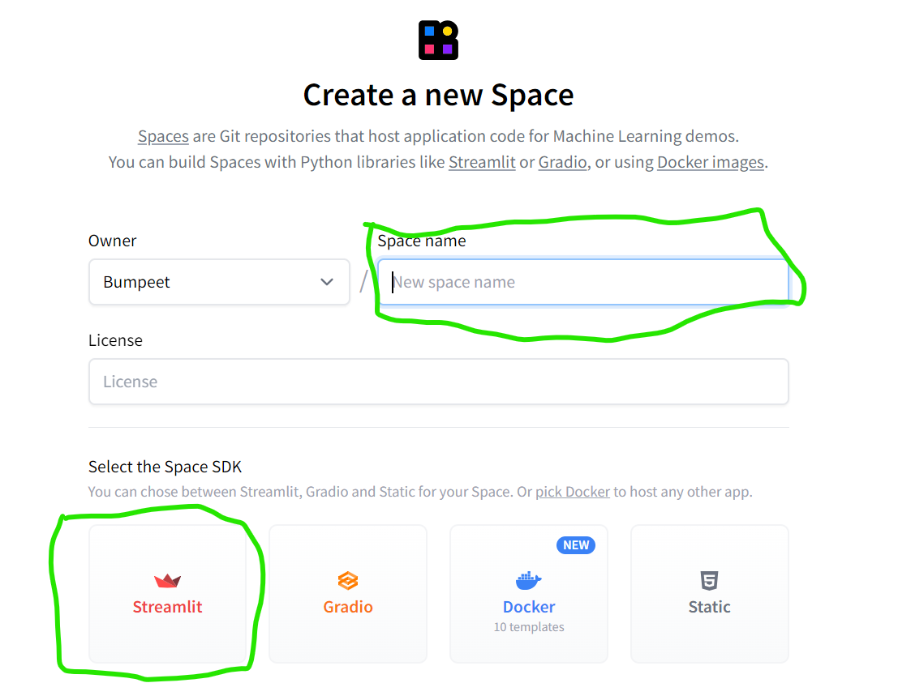

Check out the configuration reference at https://huggingface.co/docs/hub/spaces-config-reference

# Instructions on how to run on the local setup
- run these commands initially in the git bash
    - `git lfs install`
    - `git clone https://huggingface.co/spaces/Bumpeet/faceTracking`
    - `cd faceTracking`

- Now install the libraries mentioned in the requirements.txt, follow this command
    - `pip install -r requirements.txt`

- If you face any issue related to the installation of face-recognition library, make sure you install the c++ development tools from visual studio in windows. [Visual Studio Installer](https://visualstudio.microsoft.com/downloads/)

- If you facing the same issue in the linux servers then install the list of packages mentioned in the packages.txt

- Once everything is properly setup, run the following command in the terminal to explore the UI. `streamlit run app.py`

# Usage of UI

- Upload a video that contains faces of people which you want to track, here is the [link for the sample](https://drive.google.com/file/d/1fl4I2EE_07sNSm0v29VIQ4tJ61qAkdAf/view?usp=sharing)

- After uploading you'll be able to see a slider to skip the frames for better performance. For instance if you choose 3, only 0,3,6,9,.... frames are processed. If it is 4 only 0,4,8,12,.... frames are processed and rest of them will be skipped. This is for better performance.

- After that wait for some time to process the video for the clustering process and you'll be able to watch the video with the tracked faces.

- You can also download the zip file which contains the sub folder with detected
faces based on their identity.

- Remember if your video length is high then increase the slider to max value.

# Setup in the Hugging Face server

- Create an account in the Hugging Face server.
- Select to create an streamlit space, give the name of your choice. Select the license and then select the streamlit.
- 
- Upload all these files into the space that you have created and just wait.

